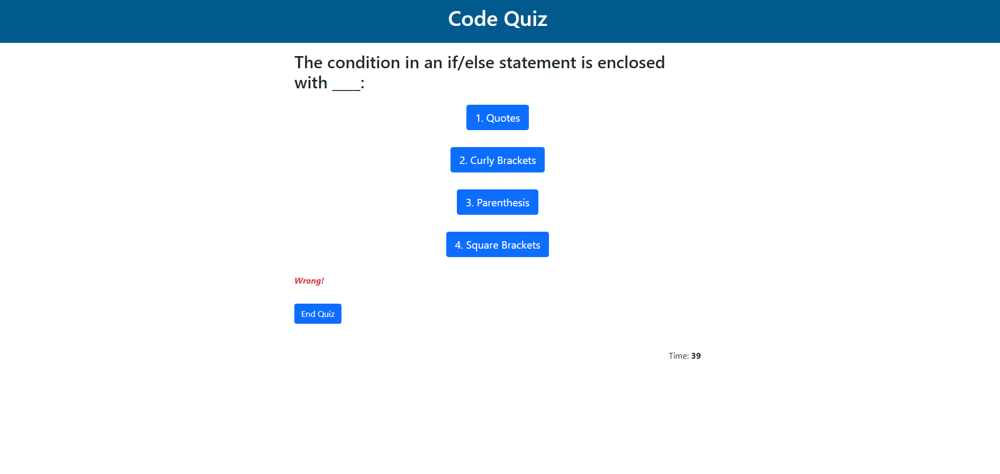
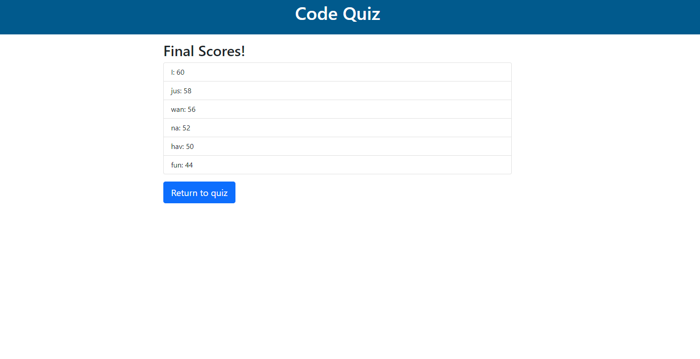

# Code Quiz
The project for week 4--A dynamic html code quiz

## Table of Contents
 - [Installation](#installation)
 - [usage](#usage)
 - [License](#license)
 - [Features](#featues)
 - [Contribution Guidelines](#contributing)
 - [Questons/Contact](#questions)

## Installation
You will need:
1. Access to the internet

## Usage
Access the Website and click the correct buttons to get the best highscore!

## License
This project does not currently have a license.

## Features
The project is only ran by html, css and Javascript files. There are 4 different pages:
Start page:
The start page has a welcome statement and a start quiz button, which, upon pressing will commence the timer/quiz.

Quiz page:
The quiz page makes questions appear which all have 4 choices. When one is clicked, the next question automatically appears on the screen replacing the previous. Once all the questions have been answered, or if the "End Quiz" button is pressed, or if the timer runst out the quiz page will disappear.

End page:
Once quiz ends, the end page appears and tells the user their score, and prompts for their initials, which will be added to the high scores.

Scores page:
The scores page appears once the submit button on the end page is pressed. Displaying to the screen all the recent high scores, so users may compare.

## Contribution Guidelines
This is a private project for instructional purposes. Future contributions are unlikely but possible.

### Questions
For any questions, please contact me:

GitHub: [imdawizard](https://github.com/imdawizard)

Email: nate.is.cool.yeah@gmail.com

## Link to Github Repo:
https://github.com/imdawizard/code_quiz

## Link to deployed application:
https://imdawizard.github.io/code_quiz

## Screenshots:

